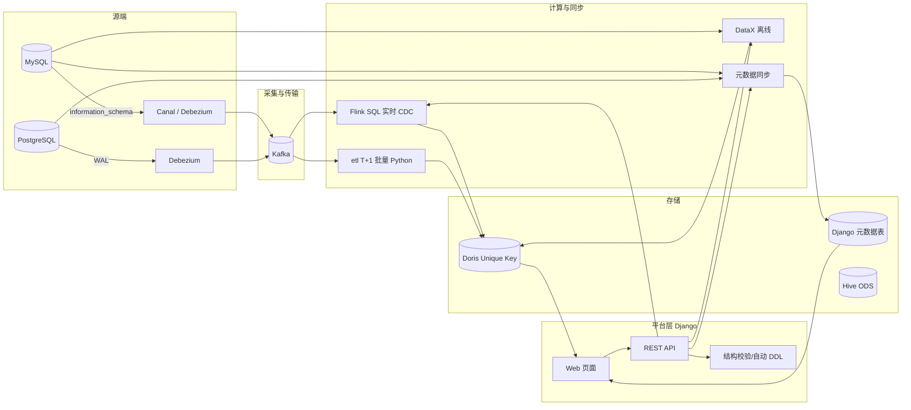

# 项目架构与模块使用文档

## 一句话定位

metadata-django 是一个**以元数据为驱动**的数据集成管理平台: 采集 MySQL/PostgreSQL 的表结构元数据,
以它为基础提供**结构校验、自动 DDL 对齐(Doris)、DataX 离线同步、Kafka(Flink/T+1) 增量入 Doris、SQL 助手**等能力,
并把"Hive/Doris 等 SQL 资产"沉淀为工程目录。

## 总体架构



## 模块地图

| 模块/目录 | 职责 | 入口 |
| --- | --- | --- |
| `common/readers` | MySQL / PostgreSQL / Doris 元数据读取 | 服务内部 |
| `common/services/sync` | 元数据入库(幂等 upsert) | `POST /api/metadata/sync/`, `manage.py sync_metadata` |
| `common/services/schema_check` | MySQL vs Doris 结构一致性校验 | `POST /api/metadata/datax/check/` |
| `common/services/schema_sync` | 自动 DDL: 新增/删除/修改字段, 自动建表 | `POST /api/metadata/schema-sync/`, `manage.py schema_sync` |
| `common/services/datax_sync` | 生成并执行 MySQL→Doris DataX job | `POST /api/metadata/datax/sync/`, `tools/datax_sync.py` |
| `common/services/flink_sync` | Flink 作业监控: 结构变更→savepoint 停止→生成 SQL→重启 | `manage.py flink_sync`, 页面 `/flink-sql/` |
| `etl/` | Kafka(PG Debezium) 一天数据 T+1 增量入 Doris | `etl/run_daily_t1.sh`, 页面 `/etl/` |
| `flink_sql/` | Flink SQL 实时 CDC 作业(源码/运行时 SQL/提交停止脚本) | `./flink_sql/submit_flink_sql.sh`, 页面 `/flink-sql/` |
| `doris_sql/` | Doris 建表/变更模板 + 从 MySQL 元数据生成 DDL | `doris_sql/generate_ddl.py` |
| `hive_sql/` | Hive 外部表模板 + 从 MySQL 元数据生成 DDL | `hive_sql/generate_ddl.py` |
| `templates/common` | Web 页面(总览/结构同步任务/DataX/ETL/Flink SQL/数据源配置/SQL 助手) | http://127.0.0.1:8000/ |
| `docs/` | 架构 / 技术栈对照 / 官方链接(本文档) | - |
| `common/services/reconcile_engine` | 对账引擎: 行数/主键快照/字段值/指标/元数据 | 页面 `/reconcile/`, `manage.py reconcile_task` |
| `common/services/sql_files` | SQL 文件库(本地/远程 SFTP) | 页面 `/sql-files/` |
| `common/services/lineage` | SQL 血缘解析与保存 | 页面 `/lineage/` |
| `common/services/llm` | 大模型分析(OpenAI 兼容) | SQL 文件库页面「AI 分析」 |

## 页面入口(全部)

| 页面 | 地址 |
| --- | --- |
| 数据源总览 | `/` |
| 结构同步任务管理 | `/schema-sync/` |
| DataX 同步 | `/datax/` |
| ETL 管理 | `/etl/` |
| Flink SQL(作业查看 + 自动同步) | `/flink-sql/` |
| 数据源配置(JDBC) | `/sources/` |
| SQL 助手 | `/sql-helper/` |
| 对账中心 / SQL 文件库 / 血缘 / 文档 | `/reconcile/`, `/sql-files/`, `/lineage/`, `/docs/` |
| 运营看板 / 脚本管理 | `/ops/`, `/scripts/` |
| 调度中心 | `/scheduler/`(脚本 + ETL 定时执行) |
| 表列表 / 表详情 | `/databases/<id>/`, `/tables/<id>/` |
| Django Admin | `/admin/` |

## 快速开始

```bash
python3 -m venv .venv && source .venv/bin/activate
pip install -r requirements.txt
cp .env.example .env       # 按需修改连接配置
python manage.py migrate
python manage.py runserver # http://127.0.0.1:8000/
```

## 定时任务清单

| 任务 | 实现 | crontab 示例 |
| --- | --- | --- |
| 元数据同步 | `manage.py sync_metadata` | `0 2 * * * ...` |
| 结构同步(Doris DDL) | `manage.py schema_sync --apply` + 管理页面 | `0 3 * * * tools/run_schema_sync.sh`(已装) |
| Kafka T+1 增量 | `etl/run_daily_t1.sh` | `30 1 * * * etl/run_daily_t1.sh` |
| Flink 结构变更监控 | `manage.py flink_sync --check` | `*/10 * * * * manage.py flink_sync --check` |
| 行数对账(源 vs Doris) | `manage.py reconcile_counts` | `0 7 * * * ... --database ai_chatbot --doris-db test_db` |

行数对账示例与告警:

调度中心(SchedulerJob)启用后会把每个任务写成独立 crontab 行
(`manage.py scheduler_run --job <id>`), 支持 shell/python/ETL 三类任务、启停与手动运行。

```bash
python manage.py reconcile_counts --database ai_chatbot --doris-db test_db
python manage.py reconcile_counts --database ai_chatbot --tables orders,users \
  --webhook https://oapi.dingtalk.com/robot/send?access_token=xxx
```

不一致时退出码为 1 并(可选)向 webhook 发送告警; 环境变量 `RECONCILE_WEBHOOK` 可替代 `--webhook`。

## 关键设计约定

- Doris 目标表必须是 **Unique Key 模型**(支撑 upsert/delete), 分布键 = 主键
- 字段变更顺序: **先 Doris → 再源端(MySQL/PG) → 最后 Flink SQL/重启**
- PG 表建议 `REPLICA IDENTITY FULL`; Debezium 建议 `decimal.handling.mode=string`
- 所有含密码/凭据的文件(如 `flink_sql/jobs.json`)已 gitignore, 只提交 example 模板
